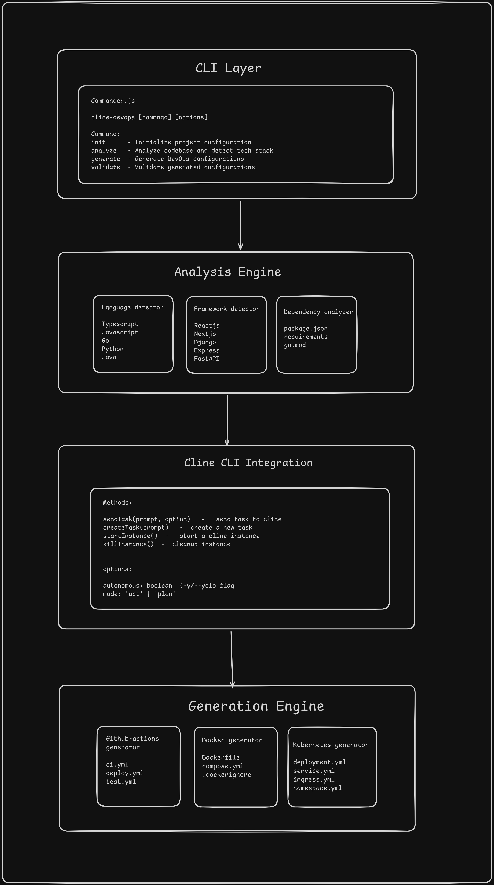

<p align="center">
  <a href="https://www.npmjs.com/package/cline-devops"></a>
  
  
  
  
</p>

<h1 align="center">🚀 Cline DevOps</h1>

<p align="center">
  <strong>AI-Powered DevOps Pipeline Generator using Cline CLI</strong>
</p>

<p align="center">
  <em>Generate production-ready CI/CD pipelines, Dockerfiles, and Kubernetes manifests for any project in minutes, not hours!</em>
</p>

<p align="center">
  <a href="https://www.youtube.com/watch?v=B3LsAgRAaJU">
    
  </a>
</p>

<p align="center">
  <strong>🎬 Click to watch the demo video</strong>
</p>

---

## Problem

> **"I just want to code, not spend hours setting up DevOps!"** - Every Developer

Setting up DevOps infrastructure is:
- ⏱️ **Time-consuming**: Hours configuring CI/CD for every new project
- 📚 **Knowledge-heavy**: Requires expertise in GitHub Actions, Docker, Kubernetes
- 🔄 **Repetitive**: Same boilerplate code written over and over
- 🐛 **Error-prone**: YAML syntax errors, security misconfigurations

---

## Solution

**Cline DevOps** leverages the power of **Cline CLI** (AI coding assistant) to:

1. **Analyze** your project automatically
2. **Generate** complete DevOps configurations using AI
3. **Validate** everything works correctly

> **From zero to full DevOps setup in under 5 minutes!**

---

##  Key Features

| Feature | Description |
|---------|-------------|
| 🔍 **Smart Project Analysis** | Auto-detects languages, frameworks, databases, and package managers |
| 🤖 **AI-Powered Generation** | Uses Cline CLI to create customized, production-ready configurations |
| 📦 **GitHub Actions CI/CD** | Complete workflows with matrix testing, caching, and deployment |
| 🐳 **Docker Support** | Multi-stage Dockerfiles + docker-compose + .dockerignore |
| ☸️ **Kubernetes Manifests** | Deployment, Service, ConfigMap, Ingress, and HPA |
| ✅ **AI Validation** | Validates syntax and security best practices |

---

## How It Works

<details>
<summary><b> System Architecture (Click to expand)</b></summary>

<br>

The CLI follows a modular architecture with clear separation of concerns:

<p align="center">
  
</p>

**Components:**
- **CLI Layer**: Entry point using Commander.js for command parsing
- **Commands**: Modular handlers for init, analyze, generate, validate
- **Generators**: Specialized modules for GitHub Actions, Docker, and Kubernetes
- **Cline Integration**: AI engine wrapper for intelligent generation

</details>

<details>
<summary><b> System Flow (Click to expand)</b></summary>

<br>

This diagram shows the complete workflow from project input to generated DevOps files:

<p align="center">
  
</p>

**Flow Steps:**
1. **Init** → Create configuration file
2. **Analyze** → Detect tech stack (static + AI)
3. **Generate** → AI creates CI/CD, Docker, K8s files
4. **Validate** → Check syntax and best practices

</details>

---

##  Quick Start

### Prerequisites

- **Node.js 18+**
- **[Cline CLI](https://cline.bot/)** installed and authenticated

### Installation

**Option 1: Install from npm (Recommended)**
```bash
npm install -g cline-devops
```

**Option 2: Build from source**
```bash
# Clone the repository
git clone https://github.com/shubhamsharma-10/Cline-devops
cd Cline-devops

# Install dependencies
npm install

# Build the project
npm run build

# Link globally
npm link
```

### Usage

```bash
# Step 1: Initialize configuration
cline-devops init -p /path/to/your/project

# Step 2: Analyze your project
cline-devops analyze -p /path/to/your/project

# Step 3: Generate DevOps configurations (AI-powered!)
cline-devops generate -p /path/to/your/project -t all -y

# Step 4: Validate generated files
cline-devops validate -p /path/to/your/project
```

---

## CLI Commands

### `cline-devops init`
Initialize DevOps configuration for your project.

```bash
cline-devops init -p <path> [-i]
```

| Flag | Description |
|------|-------------|
| `-p, --path` | Project path (default: `.`) |
| `-i, --interactive` | Interactive mode with Cline AI |

### `cline-devops analyze`
Analyze codebase and detect technologies.

```bash
cline-devops analyze -p <path> [--deep]
```

| Flag | Description |
|------|-------------|
| `-p, --path` | Project path (default: `.`) |
| `--deep` | Deep analysis using Cline AI |

### `cline-devops generate`
Generate DevOps configurations using Cline AI.

```bash
cline-devops generate -p <path> -t <type> [-y]
```

| Flag | Description |
|------|-------------|
| `-p, --path` | Project path (default: `.`) |
| `-t, --type` | `all`, `github-actions`, `docker`, or `kubernetes` |
| `-y, --autonomous` | Run Cline in fully autonomous mode |

### `cline-devops validate`
Validate generated configurations.

```bash
cline-devops validate -p <path>
```

---

## Example Output

### Quick Analysis
```bash
$ cline-devops analyze -p ./my-express-app

Analyzing project... ✔

Quick Analysis Results:

Languages: JavaScript/TypeScript
Frameworks: Express, React
Package Manager: npm
Databases: MongoDB
Has Docker: ❌
Has CI/CD: ❌

✅ Analysis saved to ./my-express-app/.devops-gen.json
```

### Generate CI/CD Pipeline
```bash
$ cline-devops generate -p ./my-express-app -t github-actions -y

Loaded existing analysis ✔

🚀 Generating DevOps Configurations with Cline CLI...

Generating GitHub Actions workflows... ✔
  ✓ Created .github/workflows/ci.yml
  ✓ Created .github/workflows/deploy.yml

✅ All configurations generated successfully!
```

---

## 📁 Project Structure

```
cline-devops/
├── src/
│   ├── index.ts              # CLI entry point (Commander.js)
│   ├── commands/
│   │   ├── init.ts           # Initialize configuration
│   │   ├── analyze.ts        # Project analysis (static + AI)
│   │   ├── generate.ts       # Orchestrate generation
│   │   └── validate.ts       # Validate all configs
│   ├── generators/
│   │   ├── github-actions.ts # GitHub Actions generator
│   │   ├── gendockerfile.ts  # Docker + docker-compose generator
│   │   └── kubernetes.ts     # K8s manifests generator
│   ├── cline/
│   │   ├── cline.ts          # Cline CLI wrapper (execa)
│   │   └── prompts.ts        # AI prompts for generation
│   └── utils/
│       └── helper.ts         # YAML/Dockerfile extractors
├── package.json
├── tsconfig.json
└── README.md
```

---

## 🔌 Deep Cline CLI Integration

This project is built around **Cline CLI** as the core AI engine:

| Integration Point | How Cline is Used |
|-------------------|-------------------|
| **Deep Analysis** | Analyzes project structure, dependencies, and recommends DevOps strategy |
| **GitHub Actions** | Generates complete CI/CD workflows tailored to detect tech stack |
| **Dockerfile** | Creates multi-stage, optimized Docker configurations |
| **docker-compose** | Generates service orchestration with proper networking |
| **Kubernetes** | Produces production-ready deployment manifests |
| **Validation** | AI-powered validation for syntax and security issues |

### Cline CLI Flags Used
```bash
-o              # Oneshot: Full autonomous mode
--yolo          # Skip all confirmations
--no-interactive # Run without user interaction
-m act          # Action mode: Actually create files
```

### How We Wrap Cline CLI
```typescript
// From src/cline/cline.ts
const response = await execa('cline', [prompt, '-o', '--yolo', '-m', 'act'], {
  cwd: projectPath,  // Run in target project directory
  timeout: 300000,   // 5 minute timeout for AI generation
});
```

---

## 📊 Supported Technologies

<table>
<tr>
<td>

### Languages
- ✅ JavaScript / TypeScript
- ✅ Python
- ✅ Go

</td>
<td>

### Frameworks
- ✅ React, Next.js, Vue.js
- ✅ Express, NestJS, Fastify
- ✅ Django, FastAPI, Flask

</td>
<td>

### Package Managers
- ✅ npm, yarn, pnpm
- ✅ pip, poetry
- ✅ go modules

</td>
</tr>
</table>

---

## 🏆 Addressing Judging Criteria

### 1️⃣ Potential Impact
| Impact Area | Description |
|-------------|-------------|
| **Time Savings** | Reduces DevOps setup from hours to minutes |
| **Accessibility** | Enables developers without DevOps expertise to set up pipelines |
| **Consistency** | Enforces best practices across all projects |
| **Real-World Use** | Any new project can benefit immediately |

### 2️⃣ Creativity & Originality
- **Novel Approach**: Using Cline CLI as a DevOps automation engine (not just code generation)
- **Unique Combination**: Static analysis + AI-powered generation + AI validation
- **Multi-Target**: Single tool generates GitHub Actions + Docker + Kubernetes

### 3️⃣ Technical Implementation
- **Clean Architecture**: Modular TypeScript with separation of concerns
- **Robust Cline Integration**: Proper process spawning, timeout handling, output parsing
- **Extensible Design**: Easy to add GitLab, Azure DevOps, AWS support

### 4️⃣ Learning & Growth
- First time building a production CLI tool with AI integration
- Learned Cline CLI autonomous mode and programmatic usage
- Explored AI-powered code generation patterns
- Improved TypeScript and Node.js skills

### 5️⃣ Aesthetics & User Experience
- Beautiful CLI output with colors and spinners (using chalk + ora)
- Clear progress indicators during AI generation
- Intuitive command structure (init → analyze → generate → validate)
- Helpful error messages

### 6️⃣ Presentation & Communication
- 📹 Demo video with captions
- 📖 Comprehensive README with examples
- 🏗️ Clear project structure documentation
- 🎯 Problem/Solution clearly stated

---

## 🛣️ Future Roadmap

- [ ] GitLab CI/CD support
- [ ] Azure DevOps pipelines
- [ ] AWS ECS/Fargate deployment configs
- [ ] Terraform infrastructure generation
- [ ] Web UI for visual configuration
- [ ] VS Code extension integration

---

## 🤝 Contributing

Contributions are welcome! Please feel free to submit a Pull Request.

1. Fork the repository
2. Create your feature branch (`git checkout -b feature/amazing-feature`)
3. Commit your changes (`git commit -m 'Add amazing feature'`)
4. Push to the branch (`git push origin feature/amazing-feature`)
5. Open a Pull Request

---

## 📄 License

MIT License - see [LICENSE](LICENSE) for details.

---

## 👨‍💻 Author

Built with ❤️ for the **WeMakeDevs Hackathon 2025**

---

<p align="center">
  <strong>⭐ Star this repo if you found it useful!</strong>
</p>
